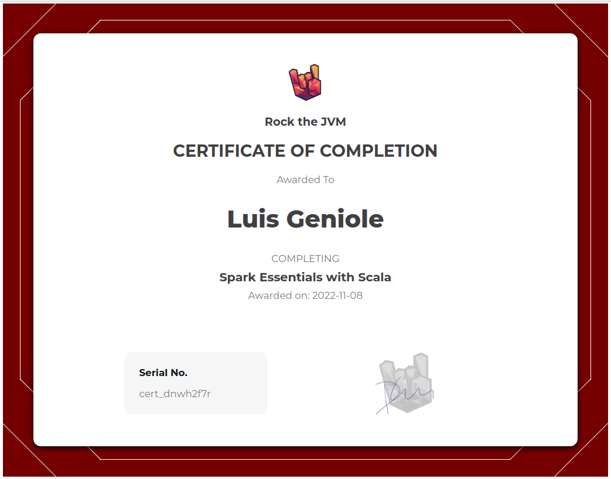

# Rock The JVM - Apache Spark Essentials

A complete introduction to Spark's core APIs with Scala.

- https://rockthejvm.com/p/spark-essentials
- https://github.com/rockthejvm/spark-essentials
- https://github.com/rockthejvm/spark-essentials/releases/tag/start

## Certificate



## Sections

1. [Scala Recap](src/main/scala/section1)
2. [DataFrames](src/main/scala/section2)
3. [Types and Datasets](src/main/scala/section3)
4. [Spark SQL](src/main/scala/section4)
5. [Low-Level API and RDDs](src/main/scala/section5)
6. [Clusters](src/main/scala/section6)
7. [Big Data](src/main/scala/section7)

## IntelliJ IDEA

- https://www.jetbrains.com/idea/

## Docker

- https://docs.docker.com/desktop/install/ubuntu/
- https://docs.docker.com/engine/install/ubuntu/#set-up-the-repository

## Postgres Database Container

```bash
$ docker compose up
```

In another shell:

```bash
$ ./psql.sh
```

## Spark Cluster Container

Build spark images for master, worker and submit (do this once):

```bash
$ cd spark-cluster
$ ./build-images.sh
```

Start a Spark cluster with 1 worker:

```bash
$ docker compose up --scale spark-worker=1
```

Connect to the master node and run the Spark SQL shell:

```bash
$ docker exec -it spark-cluster-spark-master-1 bash
$ cd spark/
$ ./bin/spark-sql
```

Or a run a Spark shell:

```bash
$ ./bin/spark-shell
```

This starts a web view listening on [localhost:4040](http://localhost:4040)

Among other tools, we can also run Spark with R and Python environments:

```bash
$ /spark/bin/sparkR
$ /spark/bin/pyspark
$ /spark/bin/spark-submit
$ /spark/bin/beeline
$ /spark/bin/find-spark-home
$ /spark/bin/spark-class
$ /spark/bin/spark-class2.cmd
$ /spark/bin/run-example
```
